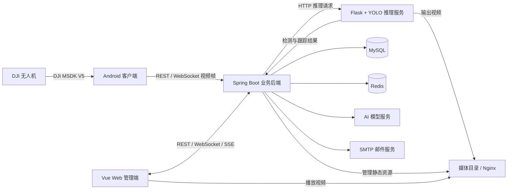

# SkyFlowTracker

**面向无人机航拍场景的车流检测、目标跟踪与飞行任务管理平台。**

SkyFlowTracker 将 DJI 无人机接入、视频帧采集、车辆检测与跟踪、飞行记录、航线规划和数据分析整合到同一套系统中。项目采用 Android 客户端、Web 管理端、Spring Boot 业务后端与 Flask 推理服务分离的架构，支持实时视频分析，也提供离线视频和演示视频处理入口。

> **首次部署前请注意：** 当前仓库不包含完整数据库初始化脚本、模型权重、演示视频、真实服务凭证或预置管理员账号。仅启动代码并不能直接获得完整可用的系统，需要先准备下文列出的依赖与配置。

## 目录

- [主要功能](#主要功能)
- [系统架构](#系统架构)
- [技术栈](#技术栈)
- [项目结构](#项目结构)
- [环境要求](#环境要求)
- [本地部署](#本地部署)
- [接口与通信入口](#接口与通信入口)
- [构建与检查](#构建与检查)
- [常见问题](#常见问题)

## 主要功能

| 模块 | 功能说明 |
| --- | --- |
| 无人机接入 | 基于 DJI Mobile SDK V5 接入设备，提供飞行界面、相机画面采集与视频帧上传 |
| 车辆检测与跟踪 | 使用 Ultralytics YOLO 进行检测与目标跟踪，当前筛选 COCO 中的 `car`、`bus`、`truck` 三类车辆 |
| 实时追踪 | 通过 WebSocket 传输视频帧、推理结果与设备在线状态，在客户端展示检测结果 |
| 推理任务 | 支持实时、离线和演示视频推理，管理任务记录、检测统计与输出视频 |
| 飞行管理 | 管理设备、飞行记录与飞行轨迹，查看飞行和推理任务详情 |
| 航线与飞行区域 | 地图绘制航点，发布、分派航线任务，展示禁飞/限飞区域并提示航线冲突 |
| 数据看板 | 展示飞行、设备与推理相关统计数据，使用图表辅助分析 |
| AI 助手 | 基于 Spring AI 接入兼容的模型服务，提供流式对话、会话历史与数据摘要 |
| 视频分享 | 创建和管理推理视频分享链接，提供独立分享访问页面 |
| 账号管理 | 邮箱验证码注册、登录、找回密码、个人资料维护与管理员审核 |

车辆统计包含基于跟踪 ID 的去重逻辑，但不应直接等同于经过标定的道路断面流量测量。检测与计数效果取决于模型、航拍角度、目标遮挡、画面质量及跟踪连续性。

## 系统架构



核心链路：Android 采集视频帧 → 后端协调推理任务 → Flask 执行车辆检测与跟踪 → 后端通过 WebSocket 推送结果。视频文件通过独立媒体服务访问，业务数据由 MySQL 持久化，Redis 用于验证码、Token 等运行状态。

离线/演示视频功能可用于不接入无人机时验证部分推理链路，但仍需要业务服务、数据库、模型与相应媒体配置。

## 技术栈

| 子项目 | 主要技术 |
| --- | --- |
| Android | Kotlin 2.1.0、Java 17、DJI Mobile SDK 5.17.0、DJI UXSDK、高德地图、Retrofit、OkHttp |
| Web | Vue 3.5、Vite 7、Vue Router 5、PrimeVue 4、Tailwind CSS 3、ECharts 5、Leaflet、Axios |
| 业务后端 | Java 17、Spring Boot 4.0.2、MyBatis 4.0.1、Spring AI 2.0.0-M2、MySQL、Redis、WebSocket、SSE |
| 推理服务 | Python、Flask、Ultralytics YOLO、OpenCV、NumPy；默认模型为 `yolo12m.pt` |
| 构建与部署 | Maven Wrapper、Gradle Wrapper、pnpm、Nginx 或等效静态资源/反向代理服务 |

具体依赖以各子项目的 `pom.xml`、`package.json`、Gradle 配置和 `requirements.txt` 为准。Python 依赖目前采用最低版本约束，并未锁定完整运行环境。

## 项目结构

```text
SkyFlowTracker/
├── SkyFlowTracker-android/             # Android 无人机客户端
│   ├── app/                           # 业务界面、设备接入、视频传输等
│   ├── android-sdk-v5-uxsdk/           # DJI UXSDK 模块
│   └── secrets.properties.example     # SDK Key 与服务地址模板
├── SkyFlowTracker-web/                 # Vue Web 管理端
│   ├── src/api/                       # 业务 API 封装
│   ├── src/views/                     # 看板、追踪、航线、任务等页面
│   ├── tests/                         # 媒体 URL 工具测试
│   └── .env.example                   # 开发代理与媒体路径模板
├── SkyFlowTracker-server/              # Spring Boot 业务后端
│   ├── config/                        # 本地配置模板
│   └── src/main/
│       ├── java/                      # 控制器、服务、Mapper、WebSocket
│       └── resources/
│           ├── mapper/                # MyBatis XML
│           └── sql/                   # 航线与飞行区域增量建表脚本
├── SkyFlowTracker-server-flask/        # Python 推理服务
│   ├── app.py                         # 检测、跟踪、视频处理接口
│   ├── models/                        # 模型存放位置，不含权重
│   ├── evaluate_model.py              # 模型评估工具
│   ├── analyze_latency.py             # 延迟分析工具
│   └── .env.ps1.example               # PowerShell 环境变量模板
└── README.md
```

## 环境要求

| 环境 | 要求或建议 |
| --- | --- |
| Java | JDK 17；后端使用自带 Maven Wrapper，Android 使用自带 Gradle Wrapper |
| Node.js | 推荐 Node.js 22.12+；Vite 7 要求 Node.js 20.19+ 或 22.12+ |
| pnpm | 用于按仓库中的 `pnpm-lock.yaml` 安装前端依赖 |
| Python | 建议 Python 3.10+，使用独立虚拟环境，并确认所选 Ultralytics / PyTorch 版本兼容 |
| 数据服务 | 建议 MySQL 8.x；需要可访问的 Redis 实例 |
| Android 工具链 | 支持 AGP 8.7.0 的 Android Studio、Android SDK 35、NDK 21.4.7075529；Gradle Wrapper 为 8.12 |
| Android 设备 | Android 7.0 / API 24 起，当前构建仅包含 `arm64-v8a`；实机接入还需 DJI SDK 支持的无人机/遥控器 |
| 推理硬件 | GPU 推理建议使用匹配驱动与 CUDA 环境的 PyTorch；实际性能需自行测试 |
| 其他 | OpenSSL（生成 JWT 密钥时使用）、SMTP 服务、媒体服务；相关功能需要 DJI / 高德及 AI 等第三方配置 |

## 本地部署

以下命令以 **Windows PowerShell** 为例。每个子项目的启动步骤均从仓库根目录打开一个新终端执行；多个服务需要分别保持运行。首次构建会下载对应依赖。

### 1. 准备数据库和外部服务

1. 创建 MySQL 数据库（默认名称为 `skyflowtracker`），准备仅具备所需权限的数据库账号。
2. 导入完整表结构，确认用户、设备、飞行、推理、分享和 AI 会话等业务表存在。
3. 启动 Redis，准备 SMTP 邮件服务；如需对应功能，准备 AI 模型服务和百度服务配置。

新注册账号默认为普通用户且处于待审核状态，首次部署还需在受控的数据库初始化流程中准备管理员账号。

### 2. 配置并启动 Spring Boot 后端

```powershell
Set-Location .\SkyFlowTracker-server

# 已有本地配置时不覆盖
if (-not (Test-Path .\config\application-local.properties)) {
    Copy-Item .\config\application-local.properties.example .\config\application-local.properties
}
```

编辑 `config/application-local.properties`，重点检查：

| 配置项 | 用途 |
| --- | --- |
| `spring.datasource.*` | MySQL 地址、账号和密码 |
| `spring.data.redis.*` | Redis 地址、端口和认证信息 |
| `spring.mail.*` | 注册、验证码等邮件功能 |
| `jwt.filePath` / `jwt.issuer` | JWT 密钥目录与签发者 |
| `flask.baseUrl` | 推理服务地址，默认 `http://localhost:5000` |
| `nginx.baseUrl` / `nginx.basePath` | 媒体访问 URL 与后端使用的磁盘根目录 |
| `spring.ai.openai.*` | AI 服务 Key、接口地址与模型名 |
| `baidu.*` | 百度服务配置 |

空值、`example.com` 和 `your-model-name` 都是占位内容，不能作为真实服务配置。AI 客户端会在后端启动时创建。

JWT 默认读取 `secrets/jwt/privatekey.pem` 和 `secrets/jwt/publickey.pem`。首次安装且没有现有密钥时，可在后端目录运行：

```powershell
# 若已有任意密钥文件，先检查密钥对，不要覆盖
if ((Test-Path .\secrets\jwt\privatekey.pem) -or (Test-Path .\secrets\jwt\publickey.pem)) {
    Write-Host '检测到已有密钥，请确认密钥对完整且可用。'
} else {
    New-Item -ItemType Directory -Path .\secrets\jwt -Force | Out-Null
    openssl genpkey -algorithm RSA -pkeyopt rsa_keygen_bits:2048 -out secrets/jwt/privatekey.pem
    openssl pkey -in secrets/jwt/privatekey.pem -pubout -out secrets/jwt/publickey.pem
}

$env:SPRING_PROFILES_ACTIVE = 'local'
.\mvnw.cmd spring-boot:run
```

默认 HTTP 端口为 `8080`。请在 `SkyFlowTracker-server` 目录启动，IDE 也需设置相同工作目录及 `local` profile，否则可能无法加载 `config/` 下的本地配置。

### 3. 配置并启动 Flask 推理服务

```powershell
Set-Location .\SkyFlowTracker-server-flask
python -m venv .venv
.\.venv\Scripts\python.exe -m pip install -r requirements.txt

if (-not (Test-Path .\.env.local.ps1)) {
    Copy-Item .\.env.ps1.example .\.env.local.ps1
}
```

从有授权的来源取得模型权重并放到 `models/yolo12m.pt`，或在 `.env.local.ps1` 中将 `YOLO_MODEL_PATH` 改为实际文件路径。权重说明见 [models/README.md](SkyFlowTracker-server-flask/models/README.md)。替换模型时，需确认类别编号与代码中的车辆类别映射一致。

如使用 CUDA，请按硬件环境安装对应的 PyTorch 版本并确认 GPU 可用，不能仅凭安装 `requirements.txt` 就认定 GPU 推理已启用。CPU 或不适合半精度的环境可在本地配置中设置 `$env:USE_HALF = 'false'`。

```powershell
. .\.env.local.ps1
.\.venv\Scripts\python.exe app.py
```

在另一个终端检查服务：

```powershell
Invoke-RestMethod http://127.0.0.1:5000/health
```

除接口可访问外，还需确认返回的 `model_loaded` 为 `true`，并检查启动日志中的模型加载和预热结果。模板将服务绑定到 `127.0.0.1:5000`；跨主机部署需要调整绑定地址并限制访问范围。

常用推理参数：

| 环境变量 | 默认值 | 说明 |
| --- | --- | --- |
| `YOLO_MODEL_PATH` | `models/yolo12m.pt` | 权重路径，相对路径基于启动目录 |
| `CONFIDENCE_THRESHOLD` | `0.5` | 默认检测置信度阈值 |
| `INFERENCE_IMGSZ` | `640` | 模型输入尺寸 |
| `USE_HALF` | `true` | 是否启用 FP16 半精度推理 |
| `VIDEO_OUTPUT_DIR` | `output/videos` | 输出视频的磁盘目录 |
| `FLASK_HOST` / `FLASK_PORT` | 模板为 `127.0.0.1` / `5000` | 服务监听地址与端口 |
| `FLASK_DEBUG` | `false` | 调试模式，公开部署不要开启 |

`app.py` 不会自动加载 `.env` 或 `.env.local.ps1`。已有 `run.bat` 也不会加载 PowerShell 配置文件，因此推荐使用上述显式加载方式。

### 4. 对齐媒体目录

视频生成成功并不代表浏览器可以播放。以下三处必须指向同一套媒体资源：

- 后端 `nginx.basePath`：媒体磁盘根目录，默认 `./data/`，相对于后端工作目录。
- Flask `VIDEO_OUTPUT_DIR`：必须对应媒体根目录下的 `videos/output/`。
- 后端 `nginx.baseUrl` 与媒体服务器：默认对外前缀为 `http://localhost/SkyFlowTracker/`。

例如，两项服务都从各自子项目目录启动、使用后端默认媒体根目录时，可在 Flask 的 `.env.local.ps1` 中设置：

```powershell
$env:VIDEO_OUTPUT_DIR = '../SkyFlowTracker-server/data/videos/output'
```

再配置 Nginx，将 `/SkyFlowTracker/` 映射到后端 `data/` 的实际绝对路径。此时 `/SkyFlowTracker/videos/output/文件名.mp4` 应能访问相应输出文件。Web 开发代理会把同源 `/nginx/...` 转发到这一媒体路径。


### 5. 启动 Web 管理端

```powershell
Set-Location .\SkyFlowTracker-web

if (-not (Test-Path .\.env.local)) {
    Copy-Item .\.env.example .\.env.local
}

pnpm install --frozen-lockfile
pnpm dev
```

默认访问 `http://127.0.0.1:5173`，实际端口以 Vite 输出为准。根据部署情况调整 `.env.local`：

| 变量 | 默认值 | 用途 |
| --- | --- | --- |
| `DEV_HOST` | `127.0.0.1` | Vite 监听地址 |
| `DEV_API_TARGET` | `http://localhost:8080` | `/api` 代理目标 |
| `DEV_WS_TARGET` | `ws://localhost:8080` | `/ws` WebSocket 代理目标 |
| `DEV_MEDIA_TARGET` | `http://localhost` | `/nginx` 媒体代理目标 |
| `VITE_MEDIA_BASE_PATH` | `/SkyFlowTracker` | 媒体服务路径前缀 |

`DEV_*` 仅用于开发服务器；`VITE_*` 会进入浏览器代码，不能存放私密凭证。修改环境配置后需要重启开发服务器。

### 6. 配置 Android 客户端（无人机接入时需要）

```powershell
Set-Location .\SkyFlowTracker-android

if (-not (Test-Path .\secrets.properties)) {
    Copy-Item .\secrets.properties.example .\secrets.properties
}
```

填写 `secrets.properties`：

- `MSDK_API_KEY`：DJI 开发者应用 Key。
- `AMAP_API_KEY`：高德地图 Android Key。
- `API_BASE_URL`：业务后端地址，必须保留 `/api/v1/` 及末尾 `/`。
- `WEB_BASE_URL`：Android 可访问的 Web 服务地址。

使用 Android Studio 打开 `SkyFlowTracker-android`，安装所需 SDK / NDK 后同步 Gradle，连接兼容的 ARM64 Android 设备构建运行。SDK Key 应按服务提供方要求绑定包名和签名证书；当前应用包名为 `com.example.skyflowtracker`。

模板中的 `10.0.2.2` 仅表示 Android 模拟器访问宿主机的特殊地址，**不能用于真实遥控器或手机**。实机需使用可达的局域网地址或域名；如访问本地 Vite，还需调整 `DEV_HOST` 并按需放行防火墙。

Android 配置优先级：同名环境变量 > Gradle 项目属性 > 本地 `secrets.properties` > 默认值。Android 内置演示功能需要自行准备合规素材并放到 `app/src/main/assets/demo_traffic.mp4`，该视频不随仓库发布。

## 接口与通信入口

业务 REST API 的统一前缀为 `/api/v1`，具体参数和权限要求以控制器与客户端 API 封装为准。

| 类型 | 路径 | 用途 |
| --- | --- | --- |
| REST | `/api/v1/users` | 注册、登录、验证码、资料与用户管理 |
| REST | `/api/v1/devices`、`/api/v1/flights` | 设备与飞行记录 |
| REST | `/api/v1/inference`、`/api/v1/dashboard` | 推理任务与统计数据 |
| REST / SSE | `/api/v1/ai` | AI 对话、摘要及会话记录 |
| REST | `/api/v1/missions`、`/api/v1/flyZones` | 航线任务与飞行区域 |
| REST | `/api/v1/share` | 视频分享 |
| WebSocket | `/ws/video-stream` | Android 视频帧上传 |
| WebSocket | `/ws/inference` | Web / Android 接收推理结果 |
| WebSocket | `/ws/device-status` | 设备在线状态推送 |
| Flask | `GET /health` | 推理服务与模型状态检查 |

接口实现可从[后端控制器](SkyFlowTracker-server/src/main/java/com/example/skyflowtracker/controller)、[Web API 封装](SkyFlowTracker-web/src/api)和 [Flask app.py](SkyFlowTracker-server-flask/app.py)查阅。Flask 是内部推理组件，不应作为未经访问控制的公网 API 暴露。

## 构建与检查

在表格指定的工作目录执行：

| 工作目录 | 命令 | 说明 |
| --- | --- | --- |
| `SkyFlowTracker-web` | `pnpm build` | 构建前端，输出到 `dist/` |
| `SkyFlowTracker-web` | `pnpm preview` | 本地预览构建产物，不是生产部署方案 |
| `SkyFlowTracker-web` | `node --test tests/media.test.mjs` | 媒体 URL 映射测试 |
| `SkyFlowTracker-server` | `.\mvnw.cmd test` | 后端测试；现有上下文测试需要有效配置和依赖服务 |
| `SkyFlowTracker-server` | `.\mvnw.cmd package` | 测试并打包后端，输出到 `target/` |
| `SkyFlowTracker-android` | `.\gradlew.bat :app:assembleDebug` | 构建调试 APK，输出到 `app/build/outputs/apk/debug/` |
| 仓库根目录 | `python scripts/check_publication.py` | 检查 Git 待发布文件中的常见敏感内容 |
| 仓库根目录 | `python scripts/test_publication_check.py` | 发布检查脚本的回归测试 |

前端生产部署需另外配置 `/api`、`/ws` 和 `/nginx` 的反向代理，支持 WebSocket Upgrade 和 AI SSE 流式响应，并为 Vue Router 的 History 模式配置回退到 `index.html`。`vite.config.js` 中的 `server.proxy` 只对开发服务器生效。


## 常见问题

| 现象 | 优先检查 |
| --- | --- |
| 后端连接数据库失败或提示表不存在 | 数据库地址、账号权限、完整表结构；仓库 SQL 不是完整初始化脚本 |
| 注册、找回密码或登录异常 | SMTP、Redis、JWT 密钥、账号审核状态以及后端日志 |
| 后端仍使用默认占位配置 | 是否从后端目录启动、是否启用 `local` profile、是否混用了配置来源 |
| 推理服务启动但检测不可用 | 模型文件是否存在、类别是否兼容、加载/预热日志、PyTorch 与半精度配置 |
| 视频有记录但无法播放 | Flask 输出目录、Nginx 路径映射、前端媒体代理是否一致，文件是否已生成 |
| 实机无法连接后端或 Web | 是否误用 `localhost` / `10.0.2.2`、服务监听地址、防火墙与设备网络 |
| 生产环境刷新页面 404 或实时画面无更新 | History 路由回退、WebSocket 反向代理及服务端连接日志 |
| SDK 注册失败或地图不显示 | Key、应用包名、签名证书限制、设备兼容性及网络连接 |


